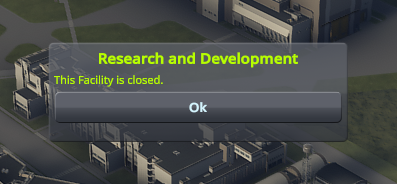

# Building Blocker

If you've ever tried the sandbox or science game modes, you probably recognize these messages:




From a storytelling perspective, there's an immersion problem here: The Kerbals built all these buildings and then just let some of them sit there, empty and unused? Just because these game modes don't have "Funds" doesn't mean you go around constructing extra, unneeded buildings for fun!

Building Blocker hides the closed facilities:


The idea for the name came from my wife. Thanks, babe!

## Download

The [latest version] is available on Github.

[latest version]: https://github.com/HebaruSan/BuildingBlocker/releases/latest

## How to donate

[![Donate][Donation image]][Donation link]

[Donation link]: https://paypal.me/HebaruSan

[Donation image]: https://i.imgur.com/M9m07Qw.png

## Building

1. Make a symbolic link to your KSP folder's KSP_Data or KSP_x64_Data folder at `Source/KSP_Data`
2. ```
   msbuild /r
   ```
   (You can omit the `/r` on the second and subsequent runs)
3. The output will be in the `GameData` folder, ready for copying to your game folder
4. To make the ZIP file:
   ```
   msbuild /t:MakeZip
   ```

## Answered questions

<dl>

<dt>What about science mode?</dt>
<dd>Yes!

</dd>

<dt>What about those little triangles of turf that used to connect to the hidden buildings?</dt>
<dd>They don't bother me enough to try to figure out how to hide them.</dd>

<dt>Can I customize which buildings are hidden? E.g., can I hide the SPH/runway for a no-planes playthrough, or hide the VAB/launchpad for a planes-only playthrough?</dt>
<dd>

Yes. There's a [config file](GameData/BuildingBlocker/BuildingBlocker-Config.cfg) that you can patch with Module Manager (editing it directly isn't recommended since your changes would be lost if you reinstall or upgrade):

```
BUILDINGBLOCKERCONFIG
{
    GAMEMODE
    {
        name = Sandbox
        HIDEFACILITY
        {
            name = Administration
        }
        HIDEFACILITY
        {
            name = MissionControl
        }
        HIDEFACILITY
        {
            name = ResearchAndDevelopment
        }
    }
    GAMEMODE
    {
        name = Science
        HIDEFACILITY
        {
            name = Administration
        }
        HIDEFACILITY
        {
            name = MissionControl
        }
    }
}
```

Specify game modes with their standard names (case-insensitive; "Science" is supported as an alias for "Science_Sandbox"):

<https://www.kerbalspaceprogram.com/ksp/api/class_game.html>

Specify buildings with their standard names (case-insensitive):

<https://www.kerbalspaceprogram.com/ksp/api/_scenario_upgradeable_facilities_8cs.html>

Multiple `BUILDINGBLOCKERCONFIG` nodes and multiple `GAMEMODE` nodes for the same game mode are allowed, so you can add some config without Module Manager. In both cases the configs will be merged.
</dd>

<dt>I don't like editing cfg files, is there an in-game UI for the config?</dt>
<dd>No, and I'm not going to work on that.</dd>

<dt>What about custom space centers and buildings?</dt>
<dd>If they use the same names as the stock buildings, I think they'll be treated the same (untested). If they have new names, you should be able to make custom configs for them (see above).</dd>

<dt>Can I crash vessels into the invisible colliders, or are they removed as well?</dt>
<dd>I have no idea. Let me know if you try it!</dd>

<dt>Are the assets for hidden buildings unloaded to save time or memory?</dt>
<dd>No. We don't know the game mode until after the assets are loaded, when you start or load a save. If you close that save and load another one in a different game mode, we sometimes need to show buildings that were hidden before, and I don't want to have to figure out how to load the assets at that point. So the assets always stay loaded.</dd>

<dt>Why not use CustomBarnKit?</dt>
<dd>It doesn't hide buildings, and it doesn't support game-mode-specific configuration. At least not as far as I was able to tell.</dd>

<dt>Why not add those features to CustomBarnKit?</dt>
<dd>

- That would be pretty complicated, and I just wanted to get this done
- CustomBarnKit doesn't seem to be under very active maintenance at the moment, so it's not clear that a big patch would be welcome
- I want the default config to do something, whereas CustomBarnKit's default config file replicates stock only as a starting point

</dd>

<dt>Is it at least compatible with CustomBarnKit?</dt>
<dd>Yes. I've tried it with both installed, and everything seemed fine.</dd>

</dl>
